<h1> Проект по тестированию мобильного приложения "Wikipedia"


## 📖 Содержание

- <a href="#about">Описание проекта</a>
- <a href="#mobile-tests">Что проверяется (Mobile-тесты)</a>
- <a href="#tools">Технологии и инструменты</a>
- <a href="#run">Запуск тестов</a>
    - <a href="#jenkins">Jenkins</a>
- <a href="#reports">Отчёты</a>
    - <a href="#allure">Allure</a>
    - <a href="#allure-testops">Allure TestOps</a>
    - <a href="#jira">Jira</a>
- <a href="#telegram">Оповещение в Telegram</a>
- <a href="#video">Пример видео прохождения Mobile-автотестов</a>

---
<a id="about"></a>

## ✅ Описание проекта

Проект предназначен для автоматизированного тестирования мобильного Android-приложения Wikipedia.
В рамках проекта реализованы mobile-автотесты, проверяющие ключевые пользовательские сценарии.

<h3>Список проверок, реализованных в автотестах:</h3>

<a id="mobile-tests"></a>

### Mobile-тесты

* Проверка запуска приложения
* Поиск контента по тексту
* Проверка открытия статьи

---
<a id="tools"></a>

### Проект реализован с использованием:

<p>
  
  
  
  
  
  
  
  
  
  
  
  
</p>

- **Python** — язык программирования, на котором написаны UI-автотесты
- **Pytest** — фреймворк для организации и запуска тестовых сценариев
- **Selene** — фреймворк для UI-автотестирования на базе Selenium WebDriver
- **Selenoid** — инструмент для удалённого запуска браузеров в контейнерах
- **Jenkins** — CI-система для параметризованного запуска автотестов
- **Allure Report** — система формирования подробных отчётов о результатах тестирования
- **Allure TestOps** — платформа для управления тест-кейсами и аналитики прогонов
- **PyCharm** — среда разработки для написания и отладки автотестов
- **Jira** — система управления задачами и дефектами
- **Telegram** — канал для уведомлений о результатах выполнения тестов
- **Appium** — это инструмент для автоматизации тестирования мобильных приложений локально
- **BrowserStack** — это облачная платформа для запуска автотестов на реальных мобильных устройствах и браузерах без
  необходимости настраивать локальную инфраструктуру

---

### Локальный запуск

#### Команды запуска в терминале:

- для запуска на Android-эмуляторе: pytest -s -v --context=emulator
- для запуска на реальном девайсе: pytest -s -v --context=local_device
- для удаленного запуска на BrowserStack: pytest -s -v --context=browserstack

> 💡 **Important**  
> Параметр `--context` необязателен, по умолчанию тесты запускаются на Android-эмуляторе.

---
<a id="run"></a>

###  Удаленный запуск автотестов выполняется на сервере Jenkins

<a href="#jenkins"></a>

### [Ссылка на сборку в Jenkins](https://jenkins.autotests.cloud/job/diplom_wiki_project_mobile_belevtseva/)

#### Для запуска автотестов в Jenkins

Открыть проект
Выбрать пункт Build with Parameters
Нажать кнопку Build

1. Открыть [Проект в Jenkins](https://jenkins.autotests.cloud/job/diplom_wiki_project_mobile_belevtseva/)
2. Выбрать пункт `Build with Parameters`
3. Выбрать тип окружения
4. Выбрать комментарий к запуску
5. Нажать кнопку `Build`
6. Результат запуска сборки можно посмотреть в отчёте Allure
   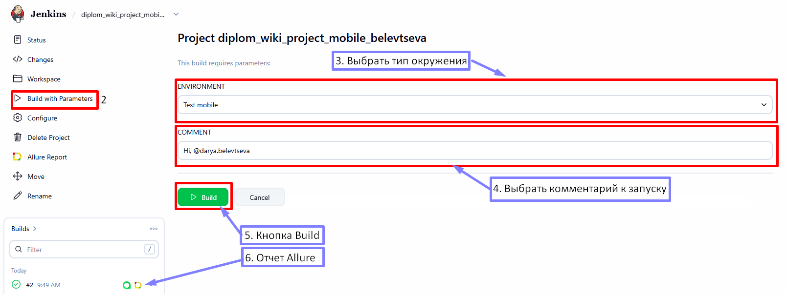

---
<a id="allure"></a>

###   Allure отчет

### [Ссылка на проект в Allure](https://jenkins.autotests.cloud/job/diplom_wiki_project_mobile_belevtseva/6/allure/)

#### Формирование отчета:

- **локальный запуск**: ввести в командной строке```allure serve allure-results```
- **запуск через Jenkins**:  кликнуть кнопку ```Allure Report``` в боковом меню

#### Результаты запусков:

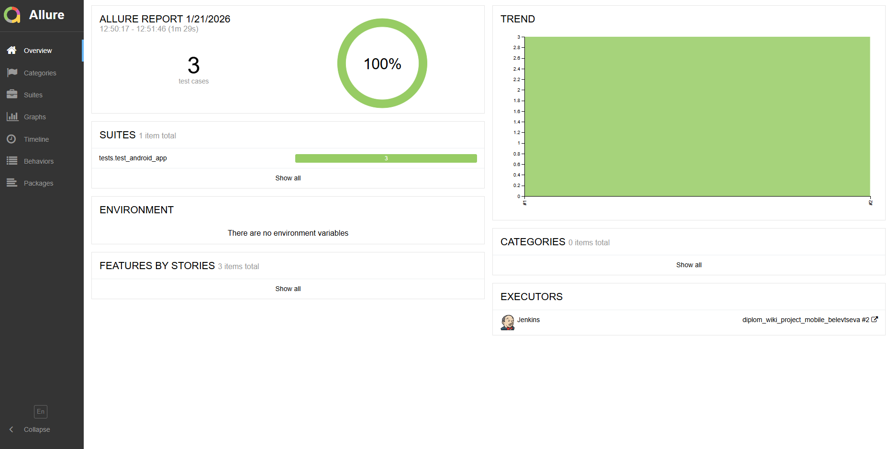
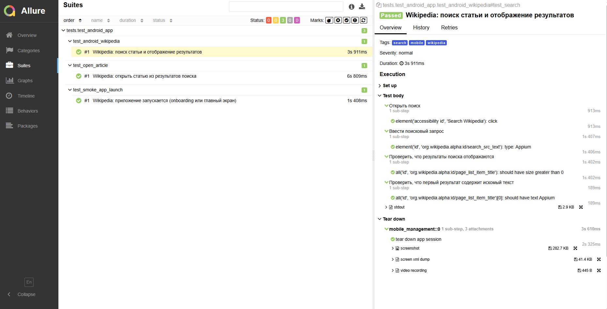
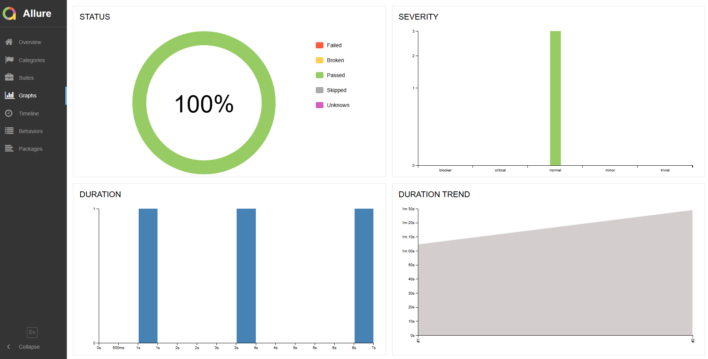

Отчет позволяет получить детальную информацию по все шагам тестов, включая скриншоты, log - файлы и видео о прохождение
теста,а так же позволяет оперативно понять причину падения теста.

---
<a id="allure-testops"></a>

###  Интеграция с Allure TestOps

### [Ссылка на проект в Allure TestOps](https://allure.autotests.cloud/project/5090/dashboards)

#### Пример dashboard с общими результатами тестирования

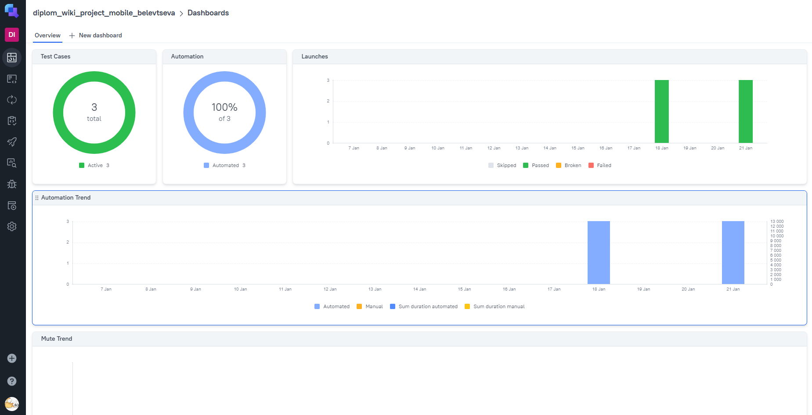

#### Общий список всех тест-кейсов

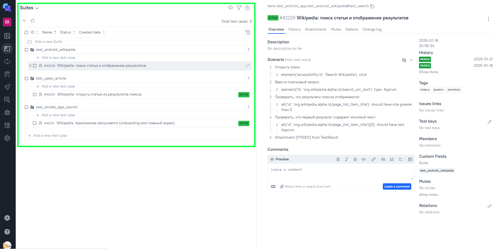

#### Пример отчёта выполнения одного из автотестов

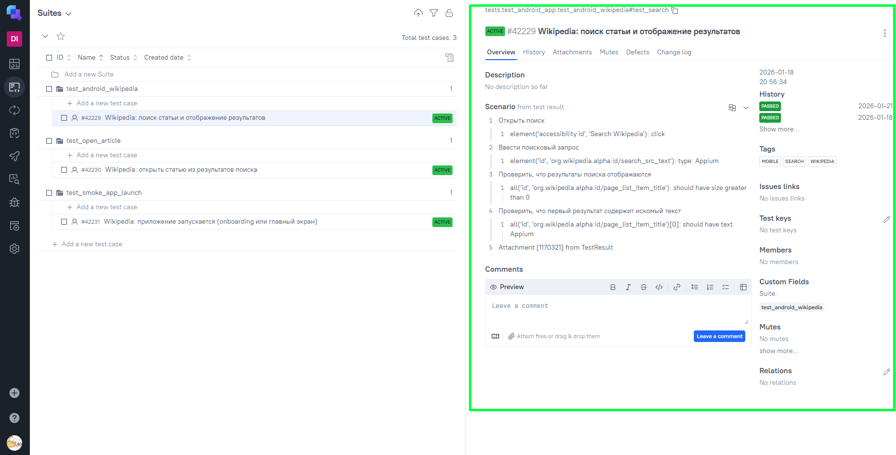

#### Пример dashboard с результатами запуска

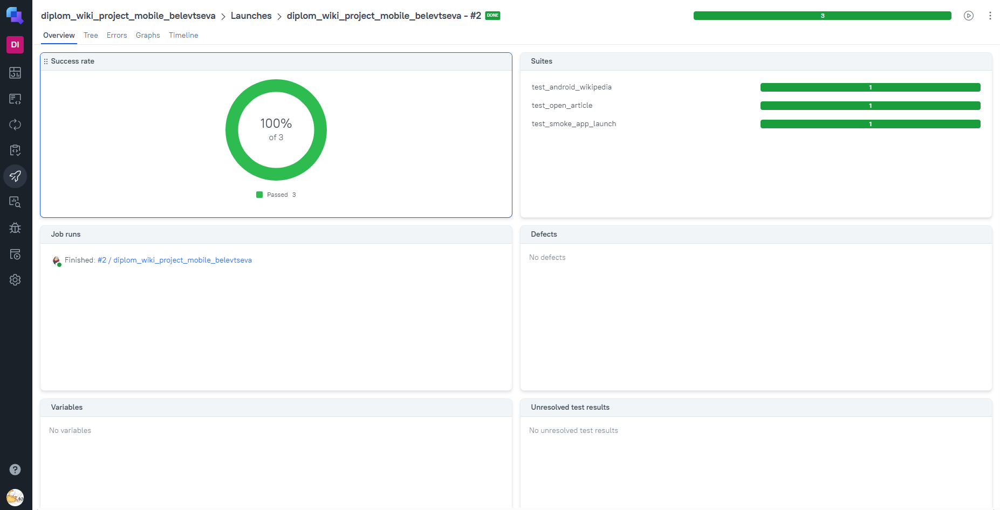

#### История запуска тестовых наборов

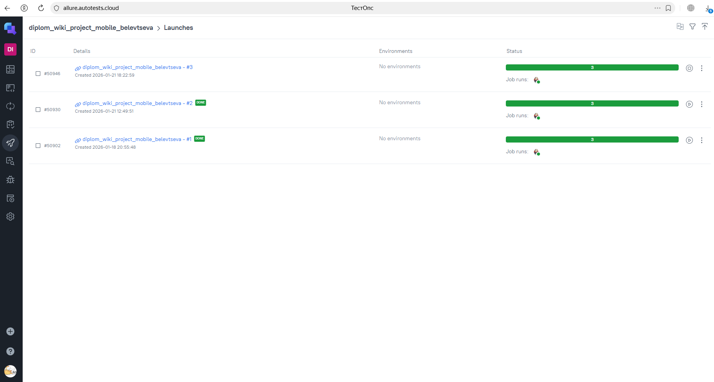

---
<a id="jira"></a>

###  Интеграция с Jira

### [Ссылка на задачу в Jira](https://jira.autotests.cloud/browse/HOMEWORK-1570)

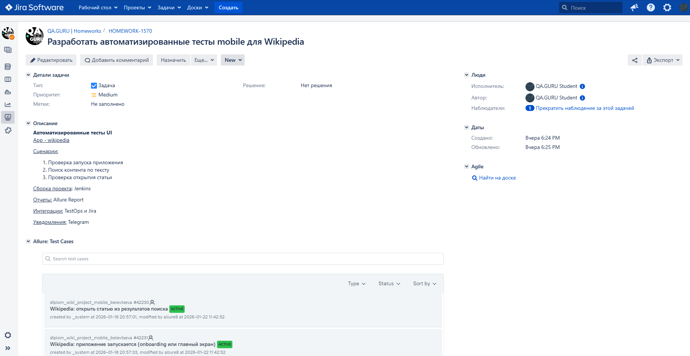
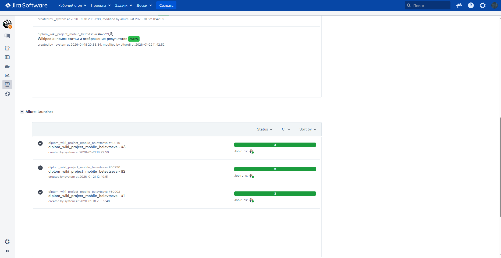
---
<a id="telegram"></a>

###  Оповещение о результатах прогона тестов в Telegram

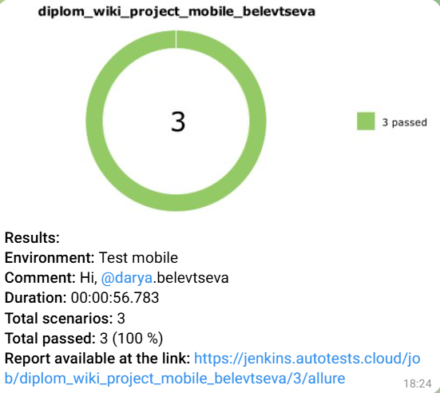
---
<a id="video"></a>

### Пример видео прохождения mobile-автотеста


